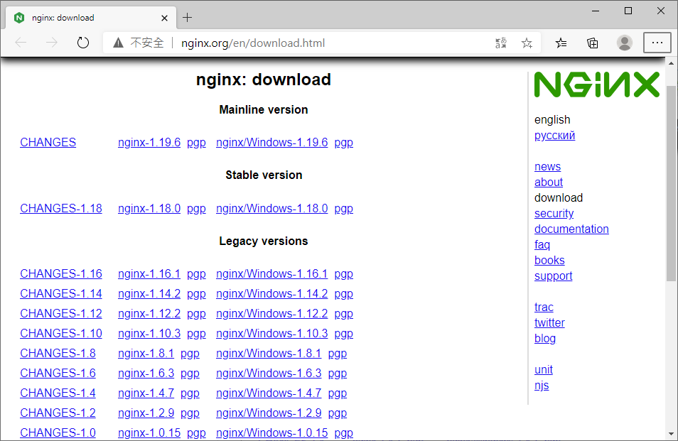
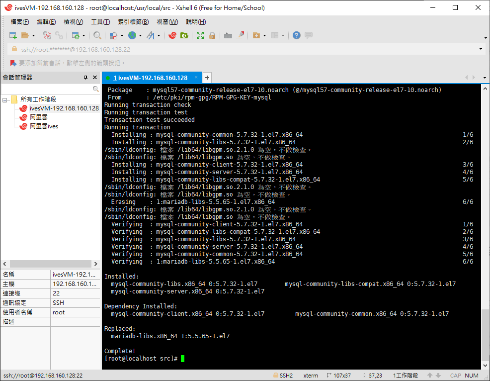

# PHP環境架設(搭配FPM、Nginx、MySQL、Redis)

# 目錄規劃


下載或要安裝的資源會放在
```bash
/usr/local/src
```


nginx會安裝在(也是預設的安裝目錄)
```bash
/usr/local/nginx
```


php會安裝在
```bash
/usr/local/php

or 

/usr/local/webserver/php
```


# Nginx下載

## 使用版本1.12.2

http://nginx.org/en/download.html



## 下載並安裝pcre依賴

### 在linux輸入指令

```bash
wget http://downloads.sourceforge.net/project/pcre/pcre/8.37/pcre-8.37.tar.gz
```

### 或直接下載下來，直接在網址輸入

http://downloads.sourceforge.net/project/pcre/pcre/8.37/pcre-8.37.tar.gz


# 安裝Nginx

## 安裝過程，請參考之前的文檔

https://github.com/IvesShe/NginxStudy

## 安裝完要打開80端口

```bash
# 查看開放的端口號
firewall-cmd --list-all

# 打開80端口(nginx預設端口)
sudo firewall-cmd --add-port=80/tcp --permanent

# 重啟防火牆
firewall-cmd --reload
```

## 安裝完成，測試畫面


### 常用指令
```bash
# 使用nginx操作命令前提條件，必須進入nginx的目錄
cd /usr/local/nginx/sbin

# 查看nginx的版本號
./nginx -v

# 啟動nginx
./nginx

# 查看nginx進程狀況
ps -ef | grep nginx

# 關閉nginx的
./nginx -s stop

# 配置文件位置
cd /usr/local/nginx/conf

# 查看有無nginx資料
find -name nginx 

# 強制關閉nginx
pkill -9 nginx 
```


# PHP下載

## 安裝版本5.3.27
### 下面文檔的部分變7.2.34是因為更換過版本，但都通用，只需更改對應的版號資料夾

https://museum.php.net/php5/


7.2.34

https://www.php.net/distributions/php-7.2.34.tar.gz

## 新增php資料夾

在/usr/local 

or 

/usr/local/webserver 

```bash
mkdir php
```


## 解壓縮php-5.3.2.tar.gz

```bash
tar -xvf php-5.3.27.tar.gz
```


## 進入/usr/local/php-5.3.2資料夾

依自己的版本更改名稱

```bash
/usr/local/php-5.3.2    # -> 進行設定、組譯並安裝

/usr/local/php          # -> 最後安裝的目錄

or

/usr/local/webserver/php          # -> 最後安裝的目錄
```
```

## 設定要編譯的php相關套件
```bash
# 這個過程如果有出現報錯的話，請依照報錯的信息提示
# 上google查詢，將所需要的套件或依賴包安裝完成
# 完全無報錯時，才能順利完成configure
# 注意:換行的\前面必須要有空格
./configure --prefix=/usr/local/php \
--with-gd \
--enable-gd-native-ttf \
--enable-gd-jis-conv \
--enable-fpm
```


有報錯，再安裝對應的依賴包


再重新configure


configure成功了!!


### 所需要的依賴包可能有(參考用)

```bash
yum install gd
yum install gd-devel
yum install libxml2
yum install libxml2-devel -y
yum install libpng
yum install libpng-devel
```


## 編譯並進行安裝
```bash
make && make install
```


## 拷貝php設定檔
在/usr/local/php(configure設定的安裝的目錄)的目錄下

or 

/usr/local/webserver/php
```bash
# cp /usr/local/src/php-5.3.27/php.ini-development ./lib/php.ini
# cp /usr/local/src/php-7.2.18/php.ini-development ./lib/php.ini
# cp /usr/local/src/php-7.2.34/php.ini-development ./lib/php.ini
cp /usr/local/src/php-7.2.34/php.ini-development /usr/local/php/etc/php.ini

or

cp /usr/local/src/php-7.2.34/php.ini-development /usr/local/webserver/php/etc/php.ini
```


## 拷貝php-fpm設定檔
```bash
# 在./configure時有加--enable-fpm，才會有php-fpm的檔案
cp /usr/local/php/etc/php-fpm.conf.default /usr/local/php/etc/php-fpm.conf

or

cp /usr/local/webserver/php/etc/php-fpm.conf.default /usr/local/webserver/php/etc/php-fpm.conf
```


# PHP7.2.18(適用php7以上)不同處(多拷貝2個檔案)
```bash
#cp php-fpm.conf.default /usr/local/webserver/php/etc/php-fpm.conf

cp /usr/local/php/etc/php-fpm.d/www.conf.default /usr/local/php/etc/php-fpm.d/www.conf

or

cp /usr/local/webserver/php/etc/php-fpm.d/www.conf.default /usr/local/webserver/php/etc/php-fpm.d/www.conf

```
## 執行php-fpm

/usr/local/php/sbin/

or

/usr/local/webserver/php/sbin/
```bash
#./sbin/php-fpm

/usr/local/php/sbin/php-fpm

or

/usr/local/webserver/php/sbin/php-fpm
```

## 查看進程
```bash
ps aux|grep /php
ps -ef|grep php
```


## 若安裝失敗的話
```bash
# php若要移除的話只需要移除/usr/local/php這個資料夾即可
# 在 /usr/local的目錄時，下指令
rm -rf php/*
```

# 若php -v看不到版本的話

```bash
cp /usr/local/php/bin/php /usr/bin/php

or

cp /usr/local/webserver/php/bin/php /usr/bin/php
```

# 修改nginx設定檔


```bash
# 在設定檔中搜尋php，找到這段並將註解打開，修改如下
# /usr/local/nginx/html/這目錄應為可變，將對應的index.php放入其中
location ~ \.php$ {
           #root           html;
           fastcgi_pass   127.0.0.1:9000;
           fastcgi_index  index.php;
           fastcgi_param  SCRIPT_FILENAME  /usr/local/nginx/html/$fastcgi_script_name;
           include        fastcgi_params;
        }
```


要記得重啟


## index.php內容

將php放至/usr/local/nginx/html/目錄(對應nginx.conf的設定)
```php
<?php
phpinfo();
```


## 執行畫面

http://192.168.160.128/index.php


# 搭配MYSQL

## 下載mysql

```bash
 wget -i -c http://dev.mysql.com/get/mysql57-community-release-el7-10.noarch.rpm
```

或直接下載


再傳到/usr/local/src內


## 安装所需要的Yum Repository

```bash
yum -y install mysql57-community-release-el7-10.noarch.rpm
```


## 開始安裝MYSQL服務器

```bash
yum -y install mysql-community-server
```




## 啟動MYSQL服務器

```bash
systemctl start  mysqld.service
```

或

```bash
service mysqld start
```

查看MYSQL運行狀態

```bash
systemctl status mysqld.service
```


## 查看版本

```bash
mysqladmin --version
```


## 查看MYSQL密碼

```bash
grep "password" /var/log/mysqld.log
```


## 首次進入MYSQL

```bash
mysql -uroot -p
```


修改默認的密碼之後，才能操作數據庫

```bash
# new password 處填入您自己的新密碼
ALTER USER 'root'@'localhost' IDENTIFIED BY 'new password';
```


```bash
ALTER USER 'root'@'localhost' IDENTIFIED BY '123456';
```

設置失敗了


MYSQL有密碼設置的規範，具體是與validate_password_policy的值有關

可以通過以下命令設置

```bash
set global validate_password_policy=0;
set global validate_password_length=1;
```


再設定一次，成功通過了


刷新權限，使新的密碼生效

```bash
flush privileges;
```


## 設置允許外部ip通過root帳號訪問數據庫

```bash
use mysql;
UPDATE user SET `Host` = '%' WHERE `User` = 'root';
```


## 查看MYSQL運行狀態

```bash
ps -ef|grep mysql
```


## 查看所使用的網路端口

```bash
# 查看當前所有tcp端口
netstat -ntlp   

# 查看所有3306端口使用情況
netstat -ntulp | grep 3306

# 查看當前所有tcp端口哪些進程佔用
netstat -antp
```


## 開啟防火牆對應端口

```bash
# 查看開放的端口號
firewall-cmd --list-all

# 打開80端口(nginx預設端口)
sudo firewall-cmd --add-port=3306/tcp --permanent

# 重啟防火牆
firewall-cmd --reload
```


# 安裝Redis

可參考之前的文檔，直接往下拉，到安裝5.0.8版本的部分

https://github.com/IvesShe/RedisStudy


## 移動檔案到/usr/local/src


## 解壓縮

```bash
tar -xvf redis-5.0.8.tar.gz 
```


## 檢查gcc版本


```bash
gcc -v
```


若無安裝gcc的話需先安裝

```bash
yum install gcc-c++
```

## 安裝redis

在解壓的redis目錄下

```bash
make
```


## 指定安裝目錄

會用預設目錄安裝
```bash
make install
```

重新下載及安裝，安裝時下參數，指定安裝資料夾
```bash
make install PREFIX=/usr/local/server/redis

or

make install PREFIX=/usr/local/webserver/redis
```


## 設置redis服務後台啟動


設置daemonize yes(先本的conf可以先備份起來)


## 啟動服務

在redis(/usr/local/src/redis-5.0.8/帶版號的那個)目錄下

```bash
src/redis-server redis.conf
```


# 用新的configure重新安裝php

## 若要查看舊系統的configure

```bash
# 可以查看該目錄的原始設定
php/bin/php-config
```

## configure或make失敗的話

可以通過以下指令，刪除編譯過的文件，然後重新用 ./configure配置
```bash
make clean
rm -f Makefile
```


另外可透過參數先make，再make install

```bash
make ZEND_EXTRA_LIBS='-liconv'
```
## 移除掉/usr/local/php的所有檔案

在/usr/local/
```bash
rm -rf php/*
```

舊的參考用
```bash
./configure --prefix=/usr/local/php \
--with-gd \
--enable-gd-native-ttf \
--enable-gd-jis-conv \
--enable-fpm
```

新的版本1
```bash
./configure \
--prefix=/usr/local/php \
--with-config-file-path=/usr/local/php/etc \
--with-zlib-dir \
--with-freetype-dir \
--enable-mbstring \
--with-libxml-dir=/usr \
--enable-xmlreader \
--enable-xmlwriter \
--enable-soap \
--enable-calendar \
--with-curl \
--with-zlib \
--with-gd \
--with-pdo-sqlite \
--with-pdo-mysql \
--with-mysqli \
--with-mysql-sock \
--enable-mysqlnd \
--disable-rpath \
--enable-inline-optimization \
--with-bz2 \
--with-zlib \
--enable-sockets \
--enable-sysvsem \
--enable-sysvshm \
--enable-pcntl \
--enable-mbregex \
--enable-exif \
--enable-bcmath \
--with-mhash \
--enable-zip \
--with-pcre-regex \
```


報錯，補安裝相關依賴


```bash
yum install bzip2-devel

```


報錯，補安裝相關依賴


```bash
yum install curl curl-devel
```


報錯，補安裝相關依賴


```bash
yum install freetype-devel
```


報錯，補安裝相關依賴


```bash
yum install mysql-devel
```


其它報錯安裝依賴參考
```bash
yum -y install libjpeg-devel
```

## configure: error: Please reinstall libedit - I cannot find readline.h 報錯特殊解法

```bash
# 先試
yum install -y readline-devel

# 沒用的話直接捉源碼 可從網頁輸入捉去
wget http://thrysoee.dk/editline/libedit-20170329-3.1.tar.gz

# 在/usr/local/src解壓
tar -xvf libedit-20170329-3.1.tar.gz

# 編譯
./configure

# 安裝
make && make install
```


## 註：新的版本一直試不成功，最後改用 新的版本2 先安裝通過了
## 終於configure成功了


## 安裝

```bash
make && make install
```


## 拷貝php設定檔
在/usr/local/php(configure設定的安裝的目錄)的目錄下
```bash
cp /usr/local/src/php-5.3.27/php.ini-development ./lib/php.ini
```


## 拷貝php-fpm設定檔
```bash
# 在./configure時有加--enable-fpm，才會有php-fpm的檔案
cp etc/php-fpm.conf.default etc/php-fpm.conf
```


## 執行php-fpm

要記得先新增user
```bash
adduser www
```

/usr/local/php/sbin/

or

/usr/local/webserver/php/sbin/
```bash
./sbin/php-fpm
```


## 查看進程
```bash
ps aux|grep /php
```

## 新版測試畫面


# 安裝Composer

參考之前的文檔

https://github.com/IvesShe/PHP_Linux_Study


# Nginx第三方模塊編譯

查看nginx編譯設定

```bash
/usr/local/nginx/sbin/nginx -V
```
